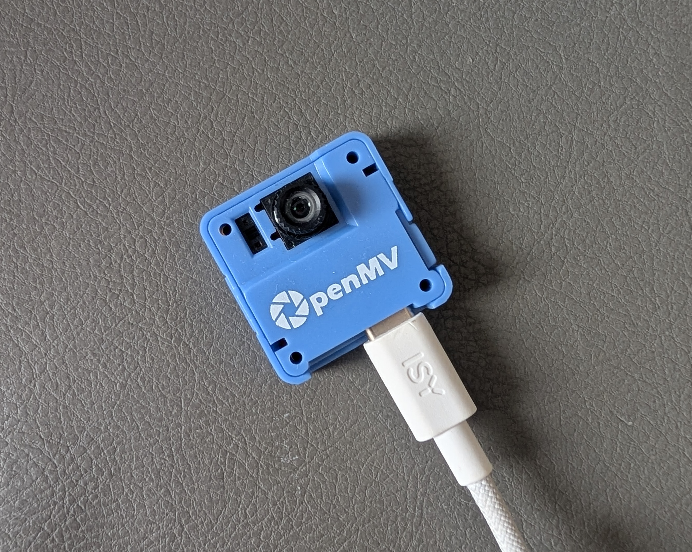

# Video via gamepad

Using the [Gamepad API](https://developer.mozilla.org/en-US/docs/Web/API/Gamepad_API) to stream video.

## Protocol

* Left stick for position
* Right stick for colour
* Buttons for sync

## Hardware

[OpenMV AE3](https://openmv.io/collections/all-products/products/openmv-ae3) (pretending to be a gamepad)

